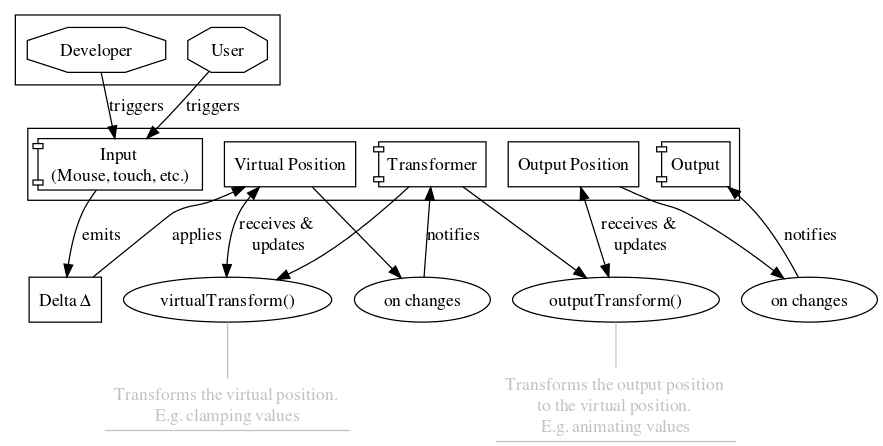

# @smoovy/scroller-core
[](https://www.npmjs.com/package/@smoovy/scroller-core) 

Core architecture to create any scroll experience you want!

## Installation
```sh
npm install --save @smoovy/scroller-core
```

## Usage
Extend from the base scroller and set your module:
```js
import { Scroller } from '@smoovy/scroller-core';

class YourScroller extends Scroller {
  get moduleCtor() {
    return YourModuleCtor;
  }
}
```

Create your scroller like this (automatic initialization):
```js
const target = document.querySelector('#scroller-target');
const scroller = new YourScroller(
  target,
  {
    // Optional config
  }
);
```
> Read more about transformers, inputs and outputs in the architecture explanation below to learn how to properly configure your scroller

### (Re)mapping delta
To merge two directions into one use the `mapDelta` method in your config:
```js
{
  mapDelta: (delta) => {
    // This will force both X and Y values to be added onto X.
    // Also locking Y. No more changes in Y will occur from here on
    delta.x += delta.y;
    delta.y = 0;

    return delta;
  }
}
```

### Scroll to
Programmatically scrolling to a specific position is also possible:
```js
scroller.scrollTo({ y: 200 });
```

If your transformers and outputs support temporary overwriting of their config, you can pass it as the second argument.

**As an example:** I want to overwrite the animation speed in my `TweenTransformer` while the programmatic scrolling is processing:

```js
scroller.scrollTo(
  { y: 200 },
  {
    transformer: {
      tween: {
        duration: 1000
      }
    }
  }
);
```

> This will overwrite the duration until the transformer tells the module it's finished.

### Trigger an update/recalc
To tell all the components to update you can simply use this:

```js
scroller.update();
```
> This will automatically be called if DOM mutations or resizes occur.

### Disabling/Enabling input emissions
To disable or enable all further input emissions:

```js
scroller.disableInputs();     // Disable
scroller.enableInputs(false); // Disable
scroller.enableInputs();      // Enable
scroller.enableInputs(true);  // Enable
```

### Destroying the scroller
To throw away your beautiful scroller:

```js
scroller.destroy();
```

## The architecture

<!--- Graphviz (Dot) code:
digraph G {
  ranksep=".5";
  rankdir="TB";

  subgraph cluster_triggers {
      color=black;
      margin=10;
      dev[shape="octagon", label="Developer"]
      user[shape="octagon", label="User"]
  }

  input[label="Input \n (Mouse, touch, etc.)", shape="component"];
  transformer[label="Transformer", shape="component"];
  output[label="Output", shape="component"];
  virtPos[label="Virtual Position", shape="box"];
  outPos[label="Output Position", shape="box"];

  delta[label="Delta Δ", shape="box"];

  dev -> input [label="triggers"];
  user -> input [label="triggers"];

  input -> delta [label="emits"];
  delta -> virtPos [label="applies"];

  virt_changes[label="on changes"];
  virtPos -> virt_changes;
  virt_changes -> transformer [label="notifies"];

  out_changes[label="on changes"];
  outPos -> out_changes;
  out_changes -> output [label="notifies"];

  virtTransformComment[
      label="Transforms the virtual position. \n E.g. clamping values",
      shape="underline",
      fontcolor="gray",
      color="gray"
  ];

  outTransformComment[
      label="Transforms the output position \n to the virtual position. \n E.g. animating values",
      shape="underline",
      fontcolor="gray",
      color="gray"
  ];

  virtTransform[label="virtualTransform()"];
  virtTransform -> virtTransformComment[dir="none", color="gray"];

  outTransform[label="outputTransform()"];
  outTransform -> outTransformComment[dir="none", color="gray"];

  virtTransform -> virtPos [label="receives & \n updates", dir="both"];
  outTransform -> outPos [label="receives & \n updates", dir="both"];

  transformer -> virtTransform;
  transformer -> outTransform;
}
-->


### 📦 The Scroller Module
The core of each `Scroller` wrapper class is the `ScrollerModule`. The Scroller module consists of `Transformers`, `Inputs` and `Outputs`. It takes care of the data flow across the components registered by you, so you just need to extend the base module class and register your inputs, outputs and transformers:

```js
import { ScrollerModule } from '@smoovy/scroller-core';

class YourCustomScrollerModule extends ScrollerModule {
  constructor(dom, config) {
    super(dom, config);

    // Register all inputs
    this.inputs = {
      dummyInput: new DummyInput(
        this.dom,
        this.config.input.dummyInput
      )
    };

    // Register all outputs
    this.outpus = {
      dummyOutput: new DummyOutput(
        this.dom,
        this.config.output.dummyOutput
      )
    };

    // Register all transformers
    this.transformers = {
      dummyTransformer: new DummyTransformer(
        this.dom,
        this.config.transformer.dummyTransformer
      )
    };
  }
}
```

> You can take a look at [this module](../scroller-tween/src/index.ts) for more details

### 📜 The Scroller itself
After you've written your custom `ScrollerModule` you can create a custom `Scroller` class like this:

```js
import { Scroller } from '@smoovy/scroller-core';

class YourScroller extends Scroller {
  get moduleCtor() {
    return YourCustomModule;
  }
}
```

To get awesome auto completion support while using **typescript** you should set the module class as the first generic for the CoreScroller:

```js
class YourScroller extends CoreScroller<YourCustomModule> {}
```

And to use your scroller:

```js
const targetElement = document.body;

new Scroller(targetElement, {
  input: {
    inp1: { /* Config for inp1 */ }
  },
  output: {
    out1: { /* Config for out1 */ }
  },
  transformer: {
    tran1: { /* Config for tran1 */ }
  }
});
```

### 🔢 The input
An input is basically the component which is going to **emit the delta changes**. As an example, here's a simple input that's just emitting a delta change after one second:

```js
import { ScrollerInput } from '@smoovy/scroller-core';

class TimeoutInput extends ScrollerInput {
  get defaultConfig() {
    return { duration: 1000 };
  }

  attach() {
    this.timeout = setTimeout(() => {
      this.emit({ x: 0, y: 200 });
    }, this.config.duration);
  }

  detach() {
    cancelTimeout(this.timeout);
  }
}
```

Registering the input in your module:

```js
class YourCustomScrollerModule extends ScrollerModule {
  constructor(dom, config) {
    super(dom, config);

    this.inputs = {
      timeout: new TimeoutInput(
        this.dom,
        this.config.input.timeout
      )
    };
  }
}
```

Changing configuration for you input:

```js
new YourScroller(document.body, {
  input: {
    timeout: {
      duration: 1500
    }
  }
})
```

> Take a look at [this input component](../scroller-shared/src/inputs/mouse-wheel-input.ts) for more details

### 🤖 The transformer
The transformer acts as a "middleware" between the input and output. It is responsible for notifying the output about any positon change. To get started with the transformer you need to understand how to use the `virtualPosition` to update the `outputPosition`.

#### Virtual position
The virtual position is basically the most up-to-date position regarding all the delta changes. So each time a delta change gets emitted it will be immediately added to the current `virtualPosition` in the `ScrollerModule`. So the virtual position is always ahead of the output position and should be used if you want to know the position the user is anticipating.

#### Output position
The output position is used by all outputs. This should be the position perceived by the user. E.g. if you have an animation this will be the current state (position) of it. Each `Output` is responsible for handling this value on its own.

#### Back to the transformer
So in your transformer you get the chance to manipulate the virtual position and output position. As an example, here is how you limit the virtual position to a range of your choice. In this case I've used the height and width of the scrollable content from the [dom](./src/dom.ts):

```js
import { ScrollerTransformer } from '@smoovy/scroller-core';
import { clamp } from '@smoovy/utils';

class ClampTransformer extends ScrollerTransformer {
  /**
   * @param position The reference to the current virtual position
   */
  virtualTransform(position) {
    const wrapperSize = this.dom.wrapper.size;
    const containerSize = this.dom.container.size;
    const maxScrollX = Math.max(wrapperSize.width - containerSize.width, 0);
    const maxScrollY = Math.max(wrapperSize.height - containerSize.height, 0);

    position.x = clamp(position.x, 0, maxScrollX);
    position.y = clamp(position.y, 0, maxScrollY);
  }

  /**
   * @param position The reference to the current output position
   * @param update Update callback to call if you've made changes to the position
   * @param complete Complete callback to call if you're done making changes
   */
  outputTransform(position, update, complete) {
    // Since we don't want to make any changes to the output position
    // we can leave that to other transformers and resolve immediately
    complete();
  }
}

```

> As an example on how to animate the output position you can take a look at [this](../scroller-tween/src/transformers/tween-transformer.ts)

### 🖨️ The output
The output is pretty simple. You get the output position so do something with it. Here's an example:

```js
import { ScrollerOutput } from '@smoovy/scroller-core';

class CssTranslateOutput extends ScrollerOutput {
  update(position) {
    this.dom.wrapper.element.style.transform = `
      translate3d(${x}px, ${y}px, 0)
    `;
  }
}
```
> For a more detailed version of the css translation output you can take a look at [this](../scroller-shared/src/outputs/css-transform-output.ts)


### 👂 Listening for changes
To listen for changes regarding the outputs, inputs and recalcs you can either register them in the config directly like this:

```js
{
  on: {
    recalc: (position) => {},
    output: (position) => {},
    input: (position) => {}
  }
}
```
> These will exist as long as the scroller is alive

You can also attach/detach the listeners later in your application:
```js
const scroller = new Scroller(target, { ... });

scroller.onRecalc(() => {});
scroller.onOutput((position) => {});
scroller.onInput((position) => {});
```

To remove a previous mentioned listener you can simply call the `remove` method on your listener:
```js
const listener = scroller.onOutput((position) => {});

listener.remove();
listener = undefined; // optional
```

### ☊ The DOM
Each output, input and transformer will be provided with a [dom provider](./src/dom.ts). This is just the base DOM structure which wraps around the target element's children. You should use this to get information from the elements inside the scrollable element. The rendered DOM looks like this:

```html
<div id="your-target">
  <div class="smoovy-container">
    <div class="smoovy-wrapper">
      <!-- Previous children of "#your-target" -->
    </div>
  </div>
</div>
```

Lets say you want to read the height of the wrapper inside your `Input`:
```js
this.dom.wrapper.size.height;
```

> The dimensions will be updated via viewport changes, DOM mutations or manual updates

#### Configuring the DOM
You register your own `wrapper` and `container` by providing them in the config accordingly:

```js
{
  dom: {
    elements: {
      container: document.querySelector('#custom-container'),
      wrapper: document.querySelector('#custom-wrapper')
    }
  }
}
```

> Make sure to pass both, the container and the wrapper, if you're going to override the default scroller DOM elements

#### Configuring DOM observers
Since the scroller uses the [@smoovy/observer](../observer) package to trigger updates, you can configure that by passing the config to the options of the dom object:

```js
{
  dom: {
    config: {
      observer: {
        mutationThrottle: 100,
        viewportThrottle: 100,
        mutators: [
          {
            target: document.documentElement,
            options: {
              subtree: true,
              characterData: true
            }
          }
        ]
      }
    }
  }
}
```

You can also disable the observer completely and handle all the updates manually:

```js
{
  dom: {
    config: {
      observer: false
    }
  }
}
```

>  You can read more about the observer configuration [here](../observer)


### ⚠️ Attention
You should always be aware what your transformers etc. are doing, since there isn't a mechanism to detect collisions.

## Development commands
```js
// Serve with parcel
npm run serve

// Build with rollup
npm run build

// Run Jest unit tests
npm run test

// Run TSLinter
npm run lint
```

## License
See the [LICENSE](../../LICENSE) file for license rights and limitations (MIT).
